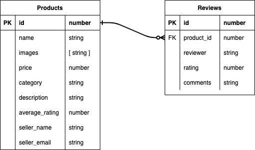

# Sell8 (will be linked to the deployed site)
## Date 12/15/21

## Nashid Alam

[LinkedIn](https://www.linkedin.com/in/nashid-alam/) | [Github](https://github.com/Nashid-Alam) | [Trello](https://trello.com/b/nzqVskYt/sell8)
*** 

## Description
Sell8 is an app that will revolutionize the selling of lightly used everyday products. Our app has a seamless user interface that allows sellers to easily post and price products and allows buyers to buy products. We have re-invented a sophisticated rating algorithm to give our buyers the confidence they need to buy with ease.

## Technologies Used
This project is made with the MERN stack:
* MongoDB
* Express
* React
* Node.js

## Getting Started with Sell8
- As you visit the app, you will see a list of products on the landing page. A buyer can easily click on any of the products listed on our site to review product details, product reviews left behind by other buyers, and of course contact the seller to buy the product. After purchasing a product, buyers also have the ability to leave behind a review for future perspective buyers.

- As a seller, the user has the ability to list new products, update the current products listing in our catalog, and remove any products that are out of stock.

## Screenshots of the App
> screenshots will go here

  
Entity Relationship Diagram

  

  
Component Hierarchy Diagram

  

### Future Updates
- [ ] User authentication
- [ ] Payment handling system

### Credits
- [facebook marketplace](https://www.facebook.com/marketplace/) 